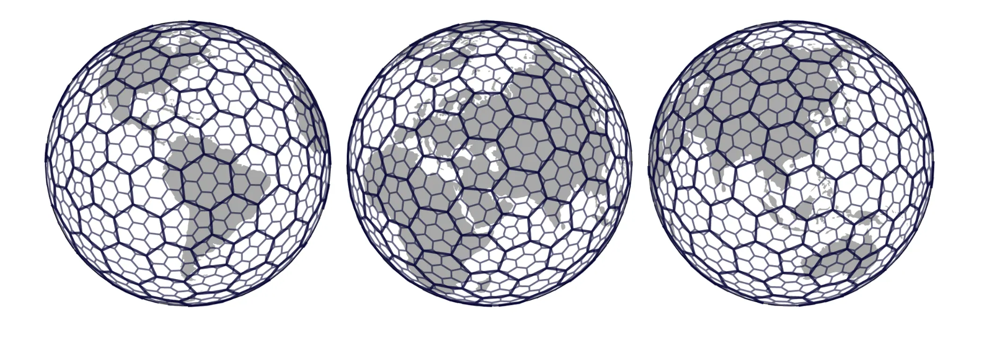
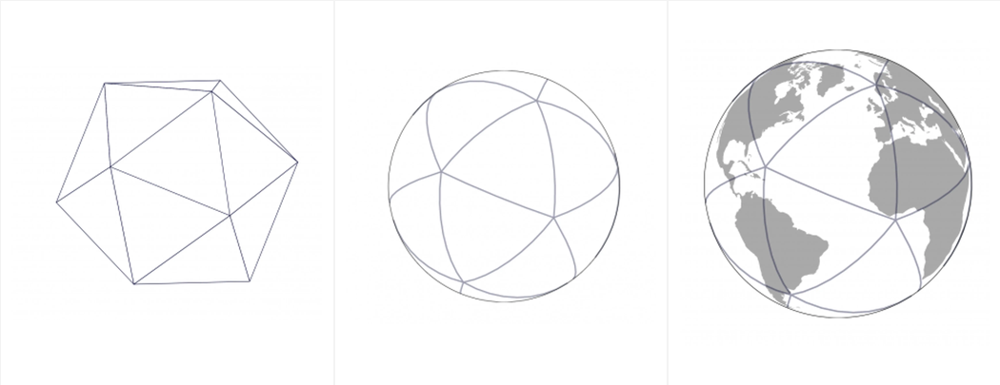

# Hexgrids



## Review of projections and grids {style="font-size:0.7em"}

Slides here with terms, then fadein out to explanation, so students can try to explain first

## Projections are not perfect {style="font-size:0.7em"}

+ distortions

## Square grids {style="font-size:0.7em"}

+ Conceptually simple

+ Multiple sets of coefficients needed for analysis due to edge neighbors and node neighbors
    + Four neighbors share an edge with the focal cell
    + Four additional neighbors touch only at a corner (node)
    + Edge and node neighbors are different distances from the focal cell's center
    + Analyses must therefore distinguish between edge-only (rook) and edge-plus-node (bishop) neighborhoods

## Icosahedron-based map projections {style="font-size:0.7em"}


::: { .r-stack}

::: {.fragment .absolute .fade-out data-fragment-index="1"}

:::

::: {.fragment .absolute .fade-in-then-out data-fragment-index="1"} 

```{=html}
<div style="text-align: center;">
  <video id="dymaxion-animation" controls loop muted playsinline preload="metadata"
         style="display: block; max-width: 90%; max-height: 52vh; width: auto; height: auto; margin: 0 auto; object-fit: contain;">
    <source src="https://upload.wikimedia.org/wikipedia/commons/9/9e/Dymaxion_2003_animation_remastered.webm"
            type="video/webm">
    Your browser does not support embedded WebM video.
  </video>
</div>
<script>
window.addEventListener("load", function () {
  const video = document.getElementById("dymaxion-animation");

  if (!video || typeof Reveal === "undefined") return;

  Reveal.on("fragmentshown", function (event) {
    if (event.fragment.contains(video)) {
      video.currentTime = 0;
      video.play().catch(function () {});
    }
  });

  Reveal.on("fragmenthidden", function (event) {
    if (event.fragment.contains(video)) {
      video.pause();
      video.currentTime = 0;
    }
  });

  Reveal.on("slidechanged", function (event) {
    if (!event.currentSlide.contains(video)) {
      video.pause();
      video.currentTime = 0;
    }
  });
});
</script>
```

::: {.attribution}
Animation by [Annaaurora](https://commons.wikimedia.org/wiki/User:Annaaurora), based on Chris Rywalt's *Dymaxion Projection Animation* and NASA's *Blue Marble: Next Generation* imagery. [Wikimedia Commons](https://commons.wikimedia.org/wiki/File:Dymaxion_2003_animation_remastered.webm), [CC0 1.0](https://creativecommons.org/publicdomain/zero/1.0/).
:::


:::

:::


##
